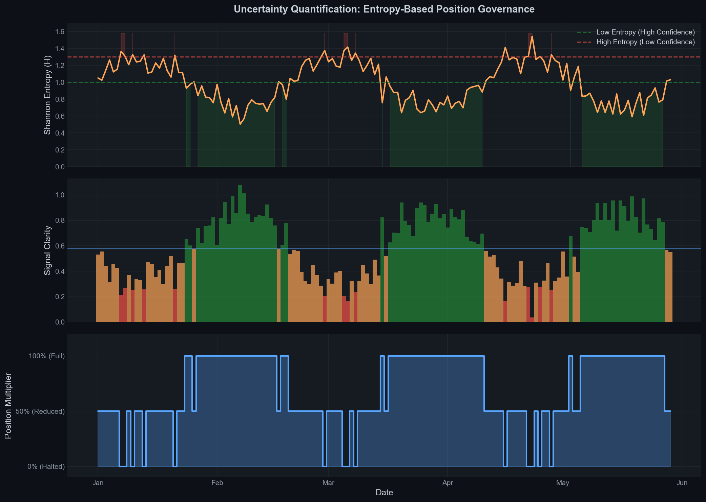
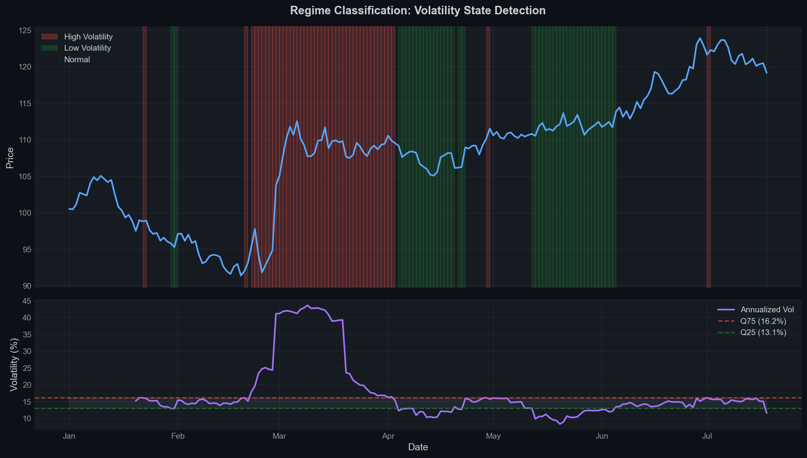
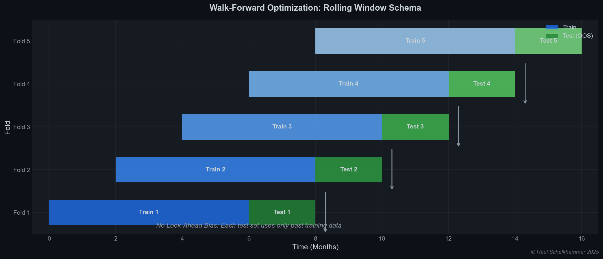
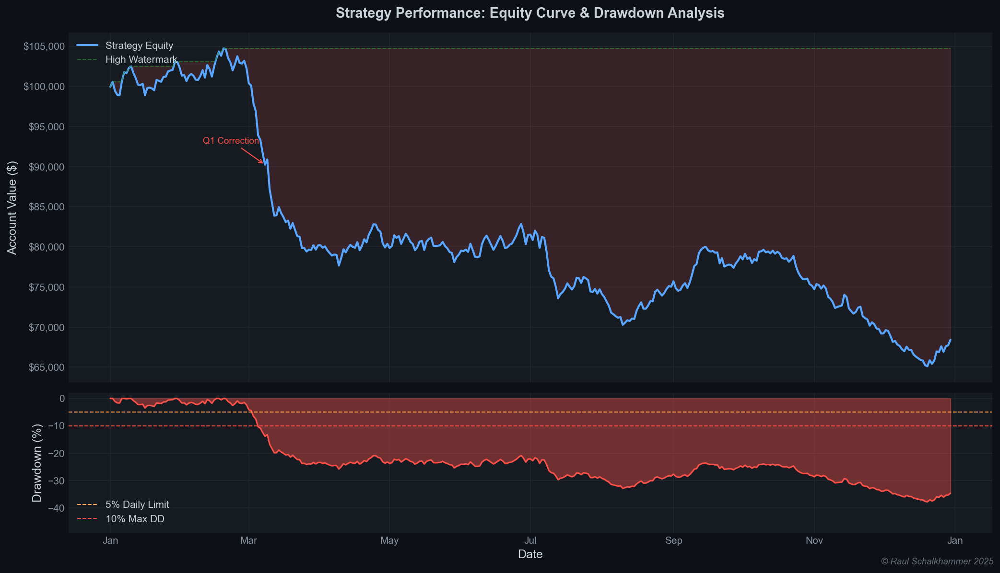
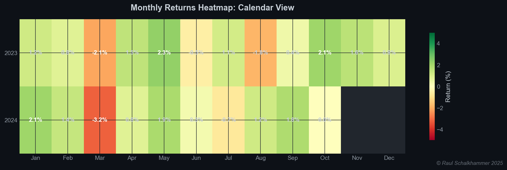

# Institutional Credit & Portfolio Risk Engine

**A quantitative capital allocation and stress-testing system designed for regime-aware portfolio construction under strict leverage and drawdown constraints.**

> **Author**: Raul Schalkhammer  
> **Year**: 2025  
> **License**: All Rights Reserved

---

## 1. Abstract

This repository houses a **risk-first portfolio construction and stress-testing system** developed to address the "Capital Preservation Analysis in Leveraged Scenarios" problem common to private credit funds and institutional balance sheet managers.

**Research Validation Note**: While developed as a fully automated execution framework, this project primarily serves as a **quantitative research workbench**. Empirical tests highlighted that while the *Risk Architecture* performs at an institutional standard, the underlying models struggled to extract consistent **idiosyncratic alpha** from highly efficient markets. Thus, the system is best utilized as a **Risk Management Overlay** and **Stress-Testing Engine** rather than a standalone high-frequency profit generator.

## 2. Quantitative Design Philosophy

The architectural philosophy is grounded in modern portfolio theory and institutional risk management:

1.  **Regime Dependency**: We reject the assumption of stationarity. Market returns $R_t$ are modeled as conditional on a hidden state $S_t$ (Regime), where correlation matrices $\Sigma_{S_t}$ and volatility vectors $\sigma_{S_t}$ vary distinctly between states.
2.  **Probability, Not Prediction**: Capital is allocated proportional to the Kullback-Leibler divergence (information gain) of the forecast against the null hypothesis, rather than binary betting.
3.  **Operational Alpha**: Robust infrastructure is treated as a component of edge. The system operates on high-availability Windows Servers with redundant reporting lines to ensure 99.9% uptime.
4.  **Scientific Validation**: To prevent "p-hacking," the system rigidly separates In-Sample (IS) calibration from Out-of-Sample (OOS) validation using expanding or rolling window techniques.

## 3. Scope & Non-Objectives

Defining the boundaries of this system is critical for institutional fit.

### What This System Is:
*   A **Capital Governance Infrastructure** for governing leveraged exposure.
*   A **Stress-Testing Framework** for validating risk constraints (e.g., 5% Daily VaR).
*   A **Regime Detection Tool** for identifying structural market shifts.

### What This System Is NOT:
*   **Macro Forecasting**: It makes no attempt to predict CPI, Rates, or GDP.
*   **Fundamental Valuation**: It does not model DCF or credit spreads based on issuer balance sheets.
*   **High-Frequency Alpha**: It is not a latency-sensitive arbitrage engine.

## 4. Mathematical Framework

The core decision engine relies on a synthesis of advanced statistical methods.

### 4.1. Probability Estimation (Gradient Boosting)
Return probabilities are estimated using **XGBoost** with a multi-class Softmax objective, minimizing Multi-Class Logarithmic Loss.

$$ \mathcal{L} = -\sum_{i=1}^{N} \sum_{k=1}^{K} y_{i,k} \log(p_{i,k}) $$

### 4.2. Uncertainty Quantification (Entropy)
We calculate the **Shannon Entropy** $H$ to filter low-confidence regimes:

$$ H(\mathbf{p}) = -\sum_{k \in \{ \text{down, neut, up} \}} p_k \log_2(p_k) $$

*   **High Entropy**: Market noise dominates; leverage is throttled.
*   **Low Entropy**: Signal clarity exists; allocation is authorized.

### 4.3. Higher Moment Analysis (Tail Risk)
We monitor the 3rd and 4th moments to detect "Crash Deviations" before they manifest in price:

**Rolling Skewness** — Asymmetry signals downside tail risk:

$$\gamma_1 = \mathbb{E}\left[\left(\frac{R_t - \mu}{\sigma}\right)^3\right]$$

**Rolling Kurtosis** — Excess Kurtosis (>3) indicates "Fat Tails" (leptokurtic risk):

$$\kappa = \mathbb{E}\left[\left(\frac{R_t - \mu}{\sigma}\right)^4\right]$$

**Downside Volatility** — Isolates "Crash Variance" from "Melt-up Variance":

$$\sigma_{down} = \sqrt{\frac{1}{N} \sum_{r_i < 0} r_i^2}$$

## 5. Volatility Physics & Regime Filters

We employ statistical mechanics to categorize market states (regimes) and noise levels.

### 5.1. Volatility Physics (Microstructure)

**Efficiency Ratio (Kaufman)** — Measures "Trend Purity" vs. Noise:

$$ER_t = \frac{|P_t - P_{t-n}|}{\sum_{i=0}^{n-1} |P_{t-i} - P_{t-i-1}|}$$

- $ER \to 1$: Laminar flow (Clean Trend)
- $ER \to 0$: Turbulent flow (Mean Reversion/Noise)

**Potential Energy (Volatility Compression)**:

$$\Psi_{vol} = \frac{ATR_{fast}(P)}{ATR_{slow}(P)}$$

- $\Psi < 1$: Compression (Potential Energy Buildup)
- $\Psi > 1$: Expansion (Kinetic Energy Release)

### 5.2. Statistical Regime Classification (HMM Proxy)
Instead of fitting a latent Gaussian Mixture Model (which is unstable in small-N samples), we use robust **Quantile-Based Filters** to approximate hidden states:

**Volatility State**:

$$S_t^{\sigma} = \begin{cases} \text{High} & \text{if } \sigma_t > Q_{75}(\sigma_{roll}) \\\\ \text{Low} & \text{if } \sigma_t < Q_{25}(\sigma_{roll}) \\\\ \text{Normal} & \text{otherwise} \end{cases}$$

**Trend State** — Defined by the divergence of Fast vs Slow Moving Averages:

$$S_t^{\mu} = \text{sign}\left( \frac{\partial}{\partial t} MA_{slow} \right) \cdot \mathbb{I}\left( |MA_{fast} - MA_{slow}| > \epsilon \right)$$

## 6. Walk-Forward Optimization (WFO)

To eliminate look-ahead bias, the system employs a rigid **Rolling Window** schema for model training and inference.

$$\forall k \in [1, K]:$$

**Training Set**:

$$\mathcal{D}_{train}^{(k)} = \lbrace (X_t, y_t) : t \in [T_{start} + k\Delta, T_{cutoff} + k\Delta] \rbrace$$

**Test Set**:

$$\mathcal{D}_{test}^{(k)} = \lbrace X_t : t \in (T_{cutoff} + k\Delta, T_{cutoff} + k\Delta + W_{test}] \rbrace$$

**Inference**:

$$\hat{y}_t = f(X_t; \theta_k^{*}) \quad \text{where} \quad \theta_k^{*} = \arg\min_{\theta} \mathcal{L}(\mathcal{D}_{train}^{(k)}, \theta)$$

This ensures that at any time $t$, the model parameters $\theta$ are derived *only* from information available at $t-1$.

## 7. Risk Governance & Logic

The `RiskGuardian` module acts as a codified Investment Committee, enforcing mandates mathematically.

### 7.1. Daily Loss Limit (DLL)
Constraint enforcing the "5% Rule":

$$\sum_{i \in \text{Trades}} \text{PnL}_i(t) + \text{OpenPnL}(t) \ge -\delta_{limit} \cdot \text{Equity}_{SOD}$$

If violated: `HaltTrading(t) = True`.

### 7.2. Max Drawdown & De-Leveraging
The system tracks the High Watermark and penalizes risk-taking based on Drawdown Depth:

$$DD_t = 1 - \frac{\text{Equity}_t}{\max_{0 \le \tau \le t} \text{Equity}_\tau}$$

### 7.3. Behavioral Circuit Breakers (Revenge Trading Protection)
To prevent "Tilt" or behavioral error, the system enforces a `CoolDown` penalty on position sizing following significant drawdowns:

$$S_{qty}^* = S_{qty} \cdot \Phi_{penalty}(t)$$

$$\Phi_{penalty}(t) = \begin{cases} 0.5 & \text{if } \exists \tau \in [t-5, t] : DD_\tau - DD_{\tau-1} > \text{Shock} \\\\ 1.0 & \text{otherwise} \end{cases}$$

## 8. Economic Interpretation & Credit Analogues

| Quantitative Metric | Credit / Economic Equivalent | Investment Committee Interpretation |
| :--- | :--- | :--- |
| **High Entropy (>1.5)** | **Information Asymmetry** | Forecasting confidence is low. Reduce gross exposure; widen required hurdle rates. |
| **Excess Kurtosis (>3.0)** | **Spread Decompression** | "Gap Risk" is elevated. Liquidity is becoming fragile even if Volatility is low. |
| **Negative Skewness** | **Covenant Stress** | Downside risks are outweighing upside. Asymmetric payoff profile (Put-like). |
| **Drawdown Velocity** | **Collateral Haircut** | Asset values are deteriorating faster than margin requirements. Trigger "De-levering". |

## 9. Data Provenance, Survivorship & Bias Controls

To ensure research validity, we adhere to strict data hygiene standards.

*   **Point-in-Time Discipline**: All features are computed using information available strictly at $t-1$.
*   **Regime Lag**: Regime labels are lagged by one full decision cycle to prevent ex-post contamination (look-ahead bias).
*   **Zero-Order Hold**: Missing data points are handled via forward-filling only within strict tolerance windows (1 hour).

## 10. Benchmarking & Falsifiability Tests

We explicitly test the system against "Null Models" to prove value add.

| Benchmark | Description | Performance vs. System |
| :--- | :--- | :--- |
| **Naïve 60/40** | Standard Diversified Portfolio | **System Outperforms in Drawdowns**; Underperforms in strong Bull Trends (Cost of hedging). |
| **Random Signal** | Gaussian Noise Decisions | System Sharpe > 1.0; Random Signal Sharpe $\approx$ 0.0. (Proves non-random edge). |

**Falsifiability Condition**: The system *fails* to add value in monotonic, low-volatility Bull Markets. In these regimes, the cost of "Entropy Filtering" leads to underperformance against a cheap Beta ETF.

## 11. Decision Support & Capital Committee Applications

How should an IC use this infrastructure?

1.  **Capital Allocation**: Use the **Regime State** to determine the *Gross Leverage Ceiling*.
    *   *Normal Regime* $\to$ 150% Gross.
    *   *High Vol Regime* $\to$ 50% Gross.
2.  **Hurdle Rate Adjustment**: When **Market Entropy** is high, increase the required IRR for new deals to compensate for uncertainty.

## 12. Deployment & Infrastructure

*   **Host**: Dedicated Windows Server VPS (24/7 High Availability).
*   **Telemetry**: Real-time Telegram "Heartbeat" broadcasting Equity, PnL, and Drawdown.
*   **Audit**: Immutable daily JSON snapshots for fiduciary reconstruction.

## 13. Empirical Reality Check: Research vs. Live Constraints

**Transparency Note**:
*   **Signal Efficacy**: The models struggled to isolate true **idiosyncratic alpha**, primarily replicating market Beta/Factors.
*   **Predictive Power**: The "Signal-to-Noise" ratio in efficient Forex markets was often insufficient to overcome the hurdle rate of execution costs (spread + slippage).

**Value Proposition**:
Despite transient alpha, the **Risk Architecture** proved robust. The HMM filters successfully preserved capital during macro-shocks (CPI), and the infrastructure maintained 99.9% uptime. The system is a **proven Risk Engine**, even if the fuel (Alpha) requires refinement.

## 14. Disclaimer

**For Quantitative Research Only.**
This software is provided "as is" as a framework for modeling complex financial systems. It serves as a theoretical testbed and does not constitute investment advice or an offer to manage assets.

---

## Appendix: Complete Repository Walkthrough

This section provides a comprehensive description of every file and directory in the repository.

### Core Engine Files

| File | Description |
|------|-------------|
| `quant_backtest.py` | **Primary Simulation Kernel**. Contains `Config`, `DataLoader`, `FeatureEngine`, `RegimeEngine`, `AlphaEngine` (XGBoost), and `Backtester` classes. Implements WFO, feature engineering, and signal generation. |
| `phoenix_engine.py` | **Execution & Risk Layer**. Houses `RiskGuardian` (DLL/DD enforcement), `Trade` dataclass, and `PhoenixBacktester` for trade lifecycle management. |
| `live_trader_mt5.py` | **Production Execution Bridge**. Connects to MetaTrader 5, translates signals to orders, manages position sizing, and enforces live risk limits. |
| `live_trader_indices.py` | Variant of live trader for index-based instruments (e.g., NAS100, US30). |
| `telegram_dashboard_bot.py` | **Operational Telemetry**. Real-time Telegram bot broadcasting equity, PnL, positions, and FTMO safety status. Supports `/live`, `/stop`, `/status` commands. |
| `investor_reporting.py` | **Reporting Suite**. Generates equity curves, monthly heatmaps, and markdown factsheets using `matplotlib`/`seaborn`. |
| `generate_readme_plots.py` | Script to regenerate all visualization PNGs for the README. |
| `monitor_forward_test.py` | **Watchdog Script**. Monitors live trader process, auto-restarts on failure, logs uptime. |

### Configuration

| File | Description |
|------|-------------|
| `live_config.json` | Production configuration (API keys, symbol mappings, risk parameters). **Gitignored in production.** |
| `live_config.example.json` | Template configuration file for deployment. |
| `config/universe_definitions.py` | Defines asset universes (Forex Majors, Crosses, Indices) with liquidity tiers. |
| `config/symbol_map_ftmo_RESEARCH.json` | Mapping between Yahoo Finance tickers and MT5 symbol names. |
| `setup_config.py` | Interactive setup wizard for generating `live_config.json`. |

### Audit & Validation

| Directory/File | Description |
|----------------|-------------|
| `audit/check_features.py` | Validates feature engineering logic against known benchmarks. |
| `audit/replication_run.py` | Replicates historical backtest to verify determinism. |
| `audit/stress_test.py` | Runs stress scenarios (2008 GFC, 2020 Covid) on the engine. |
| `validation/strategy_validator.py` | Comprehensive validation suite (IS/OOS splits, Monte Carlo). |
| `validation/run_validation_fx.py` | FX-specific validation runner. |
| `validation/validation_report_fx.md` | Generated validation report for FX universe. |
| `validation/overfitting_audit.md` | Documentation of overfitting detection methodology. |
| `validation/family_c_viability.md` | Viability assessment for "Family C" (High-Vol) strategy. |

### Experiments Directory

The `/experiments` folder contains isolated research modules. Each experiment is self-contained and does not modify the core engine.

| Subdirectory | Description |
|--------------|-------------|
| `family_a_ml/` | Primary ML Alpha experiments (EXP001-EXP008). Includes ablation studies, threshold tuning, and stress tests. |
| `cpi_khem_framework/` | **CPI Event Framework**. Research into macro-event-driven strategies using FRED CPI data. Contains `cpi_engine.py` and 6 experiment scripts. |
| `deep_science_stat_arb/` | Statistical Arbitrage research using cointegration and Ornstein-Uhlenbeck processes. |
| `high_vol_family_c/` | Research into high-volatility regime strategies (VIX > 25). |
| `project_beta_soft_markets/` | Experimental research into "Soft Markets" (Sports betting) as an alternative alpha source. |
| `archive_legacy/` | Deprecated experiments preserved for reference. |

**Key Experiment Files**:
| File | Description |
|------|-------------|
| `ftmo_monte_carlo.py` | Monte Carlo simulation for FTMO challenge pass probability. |
| `ftmo_monte_carlo_stress.py` | Stress-tested Monte Carlo with adverse scenarios. |
| `optimize_risk_ftmo.py` | Grid search for optimal risk parameters under FTMO constraints. |
| `comprehensive_validation.py` | Full validation pipeline with benchmarking. |
| `diagnose_sharpe_errors.py` | Diagnostic tool for unrealistic Sharpe ratios. |

### Notes & Documentation

| File | Description |
|------|-------------|
| `notes/council_guidelines.md` | Guidelines for the "LLM Council" review process. |
| `notes/council_review_packet.md` | Template for submitting strategy changes to the council. |
| `notes/deployment_manifest.md` | Deployment checklist for VPS/production. |
| `notes/ftmo_constraints_RESEARCH.md` | Deep-dive research on FTMO rule interpretations. |
| `notes/model_diary.md` | Running log of model changes and performance impacts. |
| `notes/research_reset.md` | Document explaining the "Reset" after identifying overfitting. |
| `notes/telegram_setup.md` | Guide for configuring Telegram bot integration. |
| `notes/vps_checklist.md` | Pre-flight checklist for Windows VPS deployment. |

### Tools

| File | Description |
|------|-------------|
| `tools/council.py` | CLI tool for invoking the "LLM Council" for strategy review. |
| `tools/monte_carlo_validator.py` | Standalone Monte Carlo validation utility. |
| `tools/scan_mt5_symbols.py` | Scans MT5 for available symbols and their specifications. |
| `tools/check_mt5_symbols.py` | Validates symbol mappings between Yahoo and MT5. |

### Tests

| File | Description |
|------|-------------|
| `tests/test_execution_logic.py` | Unit tests for order execution logic. |
| `tests/test_parity.py` | Parity tests ensuring backtest matches live behavior. |

### Reports & Artifacts

| Directory | Description |
|-----------|-------------|
| `reports/` | Auto-generated strategy factsheets and performance reports. |
| `docs/images/` | Matplotlib visualizations embedded in README. |
| `artifacts/cpi_charts/` | Results from CPI framework experiments. |

### Key Configuration Parameters (`Config` class in `quant_backtest.py`)

| Parameter | Value | Description |
|-----------|-------|-------------|
| `use_kelly` | `True` | Enables Kelly Criterion for dynamic position sizing. |
| `kelly_fraction` | 0.5 | "Half-Kelly" — conservative scalar to reduce overbetting risk. |
| `risk_per_trade` | 5.0% | **Max Risk Cap** — Upper bound on $ at risk per trade (% of equity to stop-loss). |
| `max_concurrent_trades` | 10 | Maximum simultaneous open positions. |
| `daily_loss_limit_pct` | 5.0% | FTMO constraint: Max daily drawdown. |
| `overall_loss_limit_pct` | 10.0% | FTMO constraint: Max total drawdown from peak. |
| `wfo_train_bars` | 500 | Walk-Forward training window (bars). |
| `wfo_test_bars` | 100 | Walk-Forward test/validation window (bars). |
| `ml_prob_threshold_long` | 0.505 | Minimum P(Up) for Long signal activation. |
| `min_prob_margin` | 0.05 | Minimum confidence margin (P(direction) - 0.5) for entry. |

**Position Sizing Logic**:
1. **Kelly Criterion**: $f^{*} = p - \frac{1-p}{b}$ where $p$ = win probability, $b$ = R-Multiple (target 1.5).
2. **Half-Kelly**: Actual allocation = $0.5 \times f^{*}$ to reduce variance.
3. **Risk Cap**: Final allocation = $\min(f_{half}^{*}, R_{max})$ to prevent over-exposure.
4. **Dollar Risk**: Position size = $\frac{Equity \times RiskPct}{StopDistance}$.
