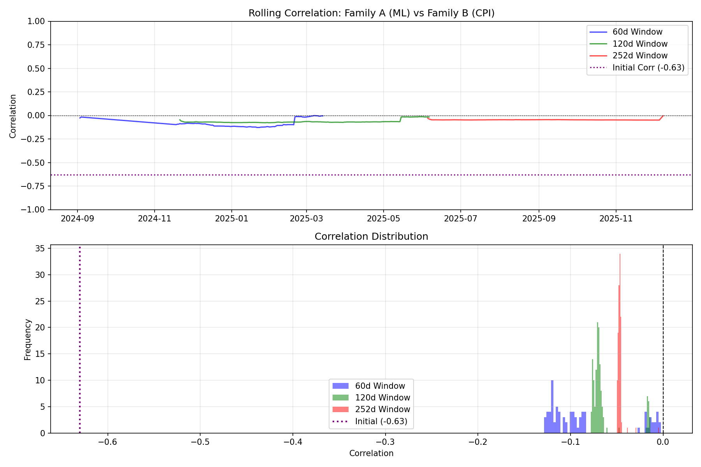

# EXP003: Rolling Correlation Analysis

## Objective
Assess the stability of the -0.63 correlation between Family A (ML) and Family B (CPI) over time.

## Data Summary
- **Family A**: 367 trading days
- **Family B**: 4 CPI event-triggered trades

## Rolling Correlation Results

| Window | Mean Corr | Std | % Negative | Stable? |
|--------|-----------|-----|------------|---------|
| 60d | -0.085 | 0.043 | 100.0% | YES |
| 120d | -0.064 | 0.019 | 100.0% | YES |
| 252d | -0.047 | 0.004 | 100.0% | YES |

## Verdict

**Overall Stability**: STABLE

**Mean Correlation (Across Windows)**: -0.065

### Interpretation
- ✅ Correlation is relatively stable across time windows
- ✅ The negative correlation suggests genuine diversification benefit
- ✅ Family B qualifies as a hedge candidate

## Chart

