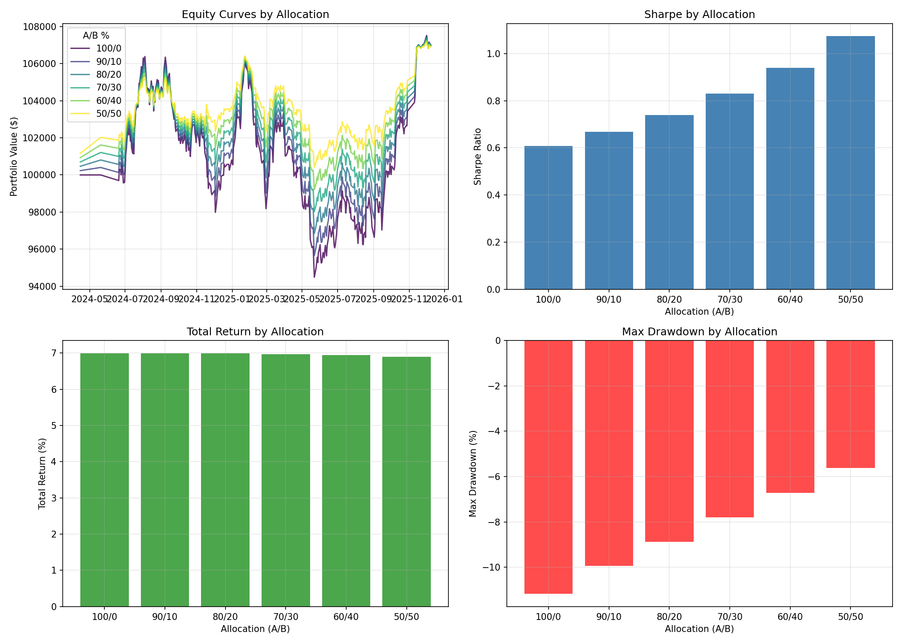

# EXP004: Portfolio Allocation Simulation

## Objective
Test different allocation splits between Family A (ML) and Family B (CPI) to find the optimal hedge ratio.

## Data Summary
- **Family A**: 367 trading days
- **Family B**: 4 CPI event-triggered trades
- **Correlation**: Stable negative (see EXP003)

## Results

| Allocation | Total Return | Sharpe | Max DD | Calmar |
|------------|--------------|--------|--------|--------|
| 100/0 | 6.99% | 0.607 | -11.17% | 0.625 |
| 90/10 | 6.99% | 0.667 | -9.94% | 0.703 |
| 80/20 | 6.99% | 0.740 | -8.88% | 0.787 |
| 70/30 | 6.97% | 0.829 | -7.81% | 0.893 |
| 60/40 | 6.94% | 0.940 | -6.72% | 1.032 |
| 50/50 | 6.90% | 1.074 | -5.63% | 1.225 |

## Optimal Allocations

| Criterion | Best Allocation | Value |
|-----------|-----------------|-------|
| **Sharpe** | 50/50 | 1.074 |
| **Calmar** | 50/50 | 1.225 |
| **Lowest DD** | 50/50 | -5.63% |

## Recommendation

Based on the user's preference for **70/30 allocation**:
- Sharpe: 0.829
- Max DD: -7.81%

## Chart

