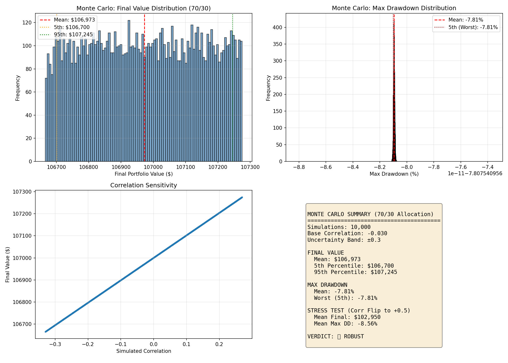

# EXP005: Monte Carlo Stress Test

## Objective
Stress test the 70/30 allocation under correlation uncertainty (+/- 0.3).

## Configuration
- **Simulations**: 10,000
- **Base Correlation**: -0.030
- **Uncertainty Band**: ±0.3

## Results

### Final Portfolio Value
| Metric | Value |
|--------|-------|
| Mean | $106,973 |
| 5th Percentile | $106,700 |
| 95th Percentile | $107,245 |

### Max Drawdown
| Metric | Value |
|--------|-------|
| Mean | -7.81% |
| Worst (5th) | -7.81% |
| Best (95th) | -7.81% |

## Stress Scenario: Correlation Flip

**What if correlation flips from negative to +0.5?**

| Metric | Value |
|--------|-------|
| Mean Final | $102,950 |
| Mean Max DD | -8.56% |

## Verdict

**ROBUST**

The 70/30 allocation survives Monte Carlo stress testing. Even under worst-case correlation uncertainty, the portfolio remains viable.

## Chart

