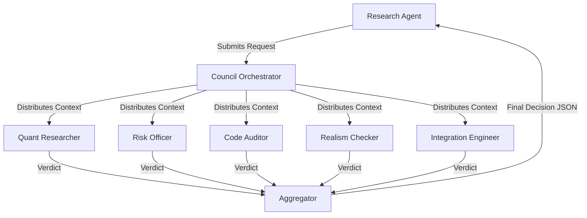

# LLM Council Design Document

**Status:** DRAFT  
**Version:** 1.0  
**Date:** 2025-12-09  

## 1. Overview

The **LLM Council** is a governance layer designed to prevent "optimism bias," overfitting, and operational risks in the quantitative development workflow. It acts as a skeptical "Committee Review" before any critical change is accepted into the stable codebase or live trading environment.

### Core Philosophy
*   **Skepticism by Default:** The council assumes every new result is a bug or statistical anomaly until proven otherwise.
*   **Ground Truth Only:** The council reviews *outputs* (artifacts, logs, diffs), not promises.
*   **Multi-Perspective:** Different virtual personas (Roles) review the change from their specific domain (Risk, Code, Stats, Ops).

## 2. Architecture

The system follows a **Proposer-Reviewer-Aggregator** pattern:

1.  **The Proposer (Research Agent):** Runs experiments, generates metrics, creates diffs, and submits a `CouncilRequest`.
2.  **The Council (Reviewers):** 5 distinct LLM calls (Roles) analyze the request in parallel (or sequential chain). Each produces a `RoleVerdict`.
3.  **The Aggregator (Chairperson):** Synthesizes the 5 verdicts into a final `CouncilDecision`.

## 3. The 6 Evaluation Axes

Every major change is evaluated on these six axes:

1.  **ASSUMPTIONS**
    *   Are implicit assumptions (e.g., "fills at mid-price", "zero latency") valid?
    *   Are new assumptions introduced? Are they documented?

2.  **APPLICABILITY (FTMO/Constraints)**
    *   Does this fit the specific constraints: 1:30 leverage, MT5 symbol set, hourly data limits?
    *   Does it violate "No Weekend Holding" or "News Trading" rules (if applicable)?

3.  **CODE CORRECTNESS**
    *   Does the code actually implement the strategy described?
    *   Are there logic bugs (e.g., look-ahead bias, index alignment errors)?
    *   Are config parameters actually used?

4.  **REALISTIC-NEWNESS (No "Magic Monsters")**
    *   Is the performance jump too high to be believed?
    *   Is the "Alpha" statistically plausible or just lucky noise?

5.  **OVERFITTING & ROBUSTNESS**
    *   Is there clear In-Sample vs Out-of-Sample separation?
    *   Are results consistent across regimes and assets?
    *   Did we try 1,000 hyperparams and pick the best one (p-hacking)?

6.  **IMPLICATIONS (System Impact)**
    *   Will this break the dashboard?
    *   Does it require a database migration?
    *   Will it conflict with the `live_trader_mt5.py` logic?

## 4. Workflow Integration

The Council is invoked **Offline** (during development/research), NOT during every tick of live trading.

**When is it invoked?**
See `notes/council_chokepoints.md`.
Examples:
*   Before merging a PR / pushing to `main`.
*   Before "Freezing" a Spec (`frozen_specs/`).
*   Before declaring a backtest "Passed".

## 5. Artifacts Required for Review

The Council effectively "reads the file system". It requires:
1.  **Diffs:** `git diff` of the proposed changes.
2.  **Metrics:** JSON/Markdown tables of backtest results (IS/OOS).
3.  **Logs:** Snippets of execution logs (to check for warnings/errors).
4.  **Config:** The strict configuration snapshot.
5.  **Context:** A brief description from the Proposer explaining *why* this change was made.
